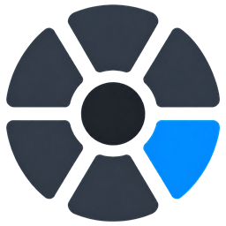
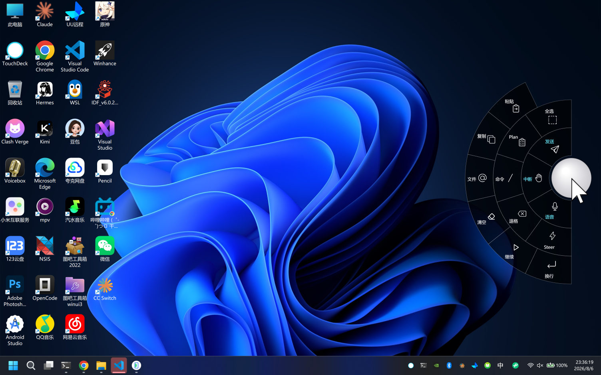
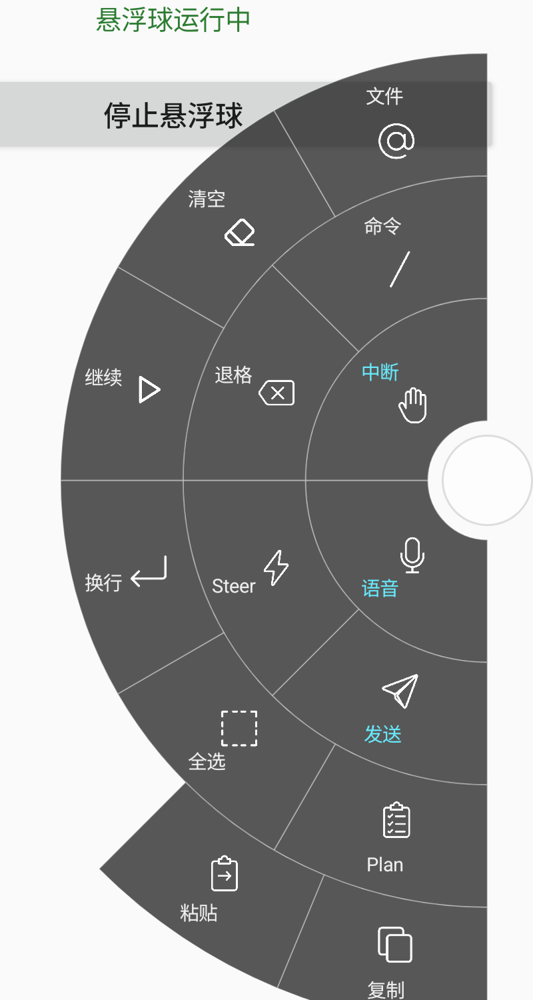
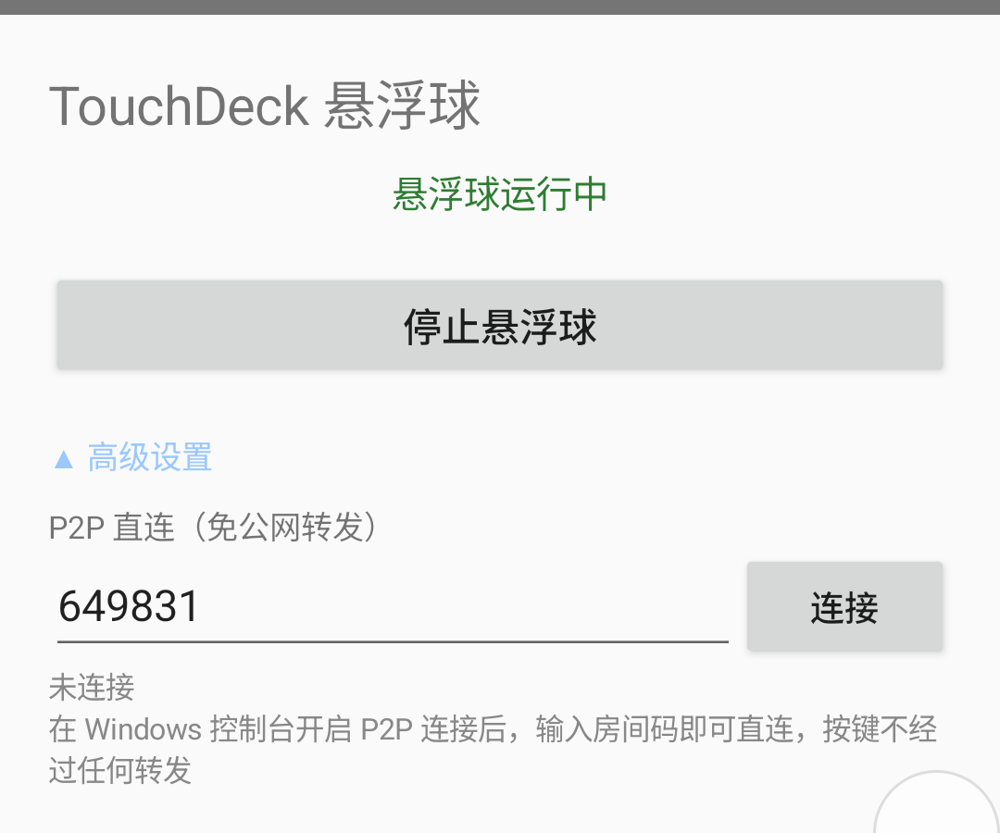

# TouchDeck

面向 Codex 等桌面 GUI 编程 Agent 的平板触控操作层。

远程桌面负责呈现完整界面，TouchDeck 负责让你在平板上可靠地触发高频命令。

## 它解决什么

平板远控 Windows 上的 GUI 编程 Agent（如 Codex）时，快捷键难触达、触控成本高、执行结果不明确。TouchDeck 用一套悬浮球 + 径向菜单把高频命令变成一次点击：

- **Windows 本机**：运行不抢焦点的悬浮球和径向菜单，快捷键发往操作前的活动窗口。
- **Android 端**：手机或平板通过 P2P 直连触发 Windows 端的高频命令。
- **可靠反馈**：每次动作都有明确的等待、成功、拦截、失败、断线状态反馈。
- **范围明确**：不替代终端映射，只补足平板远控 GUI Agent 的操作链路。

## 当前开发方向

v0.2.2 可靠指令闭环与 v0.2.3 安全配对已完成受控验证。当前进入 **v0.3.0 单一黄金工作流**：让用户无需修改 JSON，就能在平板上完成一次可靠的 GUI 编程 Agent 操作。

当前不新增第二个场景，不做通用配置编辑器、自由布局、插件或配置市场；双真机已完成安全配对、跨信令重启续连、定向 ACK、动作绑定和首轮候选验收，现已收敛为 9 个动作，下一步连续使用 7 天并按真实频率与误触继续删减。

## 界面展示

| Windows 径向菜单 | Android 径向菜单 | Android P2P 配对 |
|:----------------:|:----------------:|:----------------:|
|  |  |  |

## 快速开始

| 场景 | 命令 |
|---|---|
| 开发运行 | `npm run dev` |
| 构建后运行 | `npm run build`，再执行 `npm start` |
| 完整操作规则 | 见 [AGENTS.md](AGENTS.md) |

## 文档地图

- [AGENTS.md](AGENTS.md)：面向 Agent 的项目规则、命令、验证和范围锁定。
- [docs/roadmap.md](docs/roadmap.md)：唯一产品路线、阶段出口和停止条件。
- [docs/workflow-preset-design.md](docs/workflow-preset-design.md)：v0.3.0 GUI Agent 动作预设的社区证据、候选分级和真机判断问题。
- [docs/touchdeck-notes.md](docs/touchdeck-notes.md)：已验证的实现事实、踩坑和当前缺口。
- [CHANGELOG.md](CHANGELOG.md)：已发生的版本历史和发布说明事实来源。
- [产品定位与改进方案](docs/TouchDeck_产品定位与改进方案_v1.0.docx)：本轮路线调整的完整决策依据。
